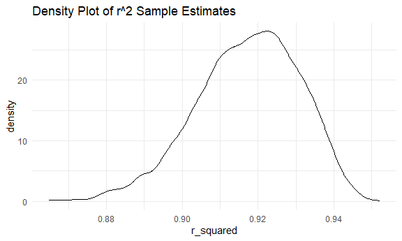
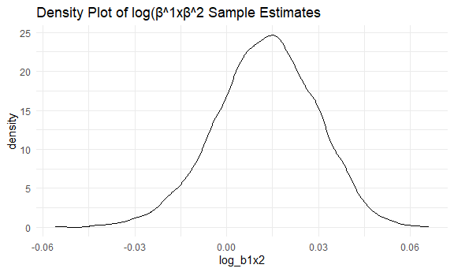
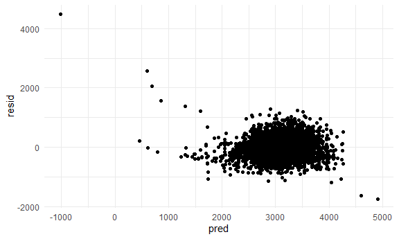
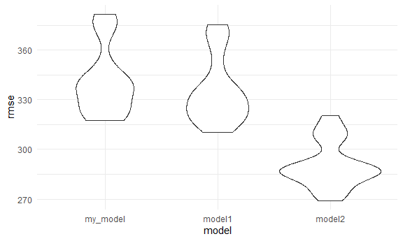

HW 6
================
Nandini M
2023-12-02

Load in libraries and set up display settings

``` r
set.seed(123)
```

## Problem 1

In the data cleaning code below we create a `city_state` variable,
change `victim_age` to numeric, modifiy victim_race to have categories
white and non-white, with white as the reference category, and create a
`resolution` variable indicating whether the homicide is solved. Lastly,
we filtered out the following cities: Tulsa, AL; Dallas, TX; Phoenix,
AZ; and Kansas City, MO; and we retained only the variables
`city_state`, `resolution`, `victim_age`, `victim_sex`, and
`victim_race`.

``` r
homicide_df = 
  read_csv("Data/homicide-data.csv", na = c("", "NA", "Unknown")) |> 
  mutate(
    city_state = str_c(city, state, sep = ", "),
    victim_age = as.numeric(victim_age),
    resolution = case_when(
      disposition == "Closed without arrest" ~ 0,
      disposition == "Open/No arrest"        ~ 0,
      disposition == "Closed by arrest"      ~ 1)
  ) |> 
  filter(victim_race %in% c("White", "Black")) |> 
  filter(!(city_state %in% c("Tulsa, AL", "Dallas, TX", "Phoenix, AZ", "Kansas City, MO"))) |> 
  select(city_state, resolution, victim_age, victim_sex, victim_race)
```

    ## Rows: 52179 Columns: 12
    ## ── Column specification ────────────────────────────────────────────────────────
    ## Delimiter: ","
    ## chr (8): uid, victim_last, victim_first, victim_race, victim_sex, city, stat...
    ## dbl (4): reported_date, victim_age, lat, lon
    ## 
    ## ℹ Use `spec()` to retrieve the full column specification for this data.
    ## ℹ Specify the column types or set `show_col_types = FALSE` to quiet this message.

Next we fit a logistic regression model using only data from Baltimore,
MD. We model `resolved` as the outcome and `victim_age`, `victim_sex`,
and `victim_race` as predictors. We save the output as `baltimore_glm`
so that we can apply `broom::tidy` to this object and obtain the
estimate and confidence interval of the adjusted odds ratio for solving
homicides comparing non-white victims to white victims.

``` r
baltimore_glm = 
  filter(homicide_df, city_state == "Baltimore, MD") |> 
  glm(resolution ~ victim_age + victim_sex + victim_race, family = binomial(), data = _)

baltimore_glm |> 
  broom::tidy() |> 
  mutate(
    OR = exp(estimate), 
    OR_CI_upper = exp(estimate + 1.96 * std.error),
    OR_CI_lower = exp(estimate - 1.96 * std.error)) |> 
  filter(term == "victim_sexMale") |> 
  select(OR, OR_CI_lower, OR_CI_upper) |>
  knitr::kable(digits = 3)
```

|    OR | OR_CI_lower | OR_CI_upper |
|------:|------------:|------------:|
| 0.426 |       0.325 |       0.558 |

Below, by incorporating `nest()`, `map()`, and `unnest()` into the
preceding Baltimore-specific code, we fit a model for each of the
cities, and extract the adjusted odds ratio (and CI) for solving
homicides comparing non-white victims to white victims. We show the
first 5 rows of the resulting dataframe of model results.

``` r
model_results = 
  homicide_df |> 
  nest(data = -city_state) |> 
  mutate(
    models = map(data, \(df) glm(resolution ~ victim_age + victim_sex + victim_race, 
                             family = binomial(), data = df)),
    tidy_models = map(models, broom::tidy)) |> 
  select(-models, -data) |> 
  unnest(cols = tidy_models) |> 
  mutate(
    OR = exp(estimate), 
    OR_CI_upper = exp(estimate + 1.96 * std.error),
    OR_CI_lower = exp(estimate - 1.96 * std.error)) |> 
  filter(term == "victim_sexMale") |> 
  select(city_state, OR, OR_CI_lower, OR_CI_upper)

model_results |>
  slice(1:5) |> 
  knitr::kable(digits = 3)
```

| city_state      |    OR | OR_CI_lower | OR_CI_upper |
|:----------------|------:|------------:|------------:|
| Albuquerque, NM | 1.767 |       0.831 |       3.761 |
| Atlanta, GA     | 1.000 |       0.684 |       1.463 |
| Baltimore, MD   | 0.426 |       0.325 |       0.558 |
| Baton Rouge, LA | 0.381 |       0.209 |       0.695 |
| Birmingham, AL  | 0.870 |       0.574 |       1.318 |

Below we generate a plot of the estimated ORs and CIs for each city,
ordered by magnitude of the OR from smallest to largest. From this plot
we see that most cities have odds ratios that are smaller than 1,
suggesting that crimes with male victims have smaller odds of resolution
compared to crimes with female victims after adjusting for victim age
and race. This disparity is strongest in New yrok. In roughly half of
these cities, confidence intervals are narrow and do not contain 1,
suggesting a significant difference in resolution rates by sex after
adjustment for victim age and race.

``` r
model_results |> 
  mutate(city_state = fct_reorder(city_state, OR)) |> 
  ggplot(aes(x = city_state, y = OR)) + 
  geom_point() + 
  geom_errorbar(aes(ymin = OR_CI_lower, ymax = OR_CI_upper)) + 
  theme(axis.text.x = element_text(angle = 90, hjust = 1))
```


## Problem 2

Load in Data:

``` r
weather_df = 
  rnoaa::meteo_pull_monitors(
    c("USW00094728"),
    var = c("PRCP", "TMIN", "TMAX"), 
    date_min = "2022-01-01",
    date_max = "2022-12-31") |>
  mutate(
    name = recode(id, USW00094728 = "CentralPark_NY"),
    tmin = tmin / 10,
    tmax = tmax / 10) |>
  select(name, id, everything())
```

    ## using cached file: C:\Users\Nandini\AppData\Local/R/cache/R/rnoaa/noaa_ghcnd/USW00094728.dly

    ## date created (size, mb): 2023-10-03 10:22:11.818914 (8.542)

    ## file min/max dates: 1869-01-01 / 2023-09-30

We’ll focus on a simple linear regression with tmax as the response with
tmin and prcp as the predictors, and are interested in the distribution
of two quantities estimated from these data: r^2, log(β^1 ∗ β^2) Use
5000 bootstrap samples and, for each bootstrap sample, produce estimates
of these two quantities.

``` r
boot_strap_weather = weather_df |> 
  modelr::bootstrap(n = 5000, id = "strap_number") |> 
  mutate(
    models = map(.x = strap, \(df) lm(tmax ~ tmin + prcp, data = df)),
    results = map(models, broom::tidy),
    corr = map(models, broom::glance)) |> 
  select(-strap, -models) |> 
  unnest(results) |> 
  filter(term %in% c("tmin","prcp")) |> 
  group_by(strap_number) |> 
  mutate(log_b1x2 = log(sum(estimate))) |> 
  select(log_b1x2, corr) |> 
  unnest(corr) |> 
  janitor::clean_names() |> 
  select(strap_number, log_b1x2, r_squared)
```

    ## Adding missing grouping variables: `strap_number`

``` r
boot_strap_weather
```

    ## # A tibble: 10,000 × 3
    ## # Groups:   strap_number [5,000]
    ##    strap_number log_b1x2 r_squared
    ##    <chr>           <dbl>     <dbl>
    ##  1 0001          0.0127      0.916
    ##  2 0001          0.0127      0.916
    ##  3 0002          0.0125      0.914
    ##  4 0002          0.0125      0.914
    ##  5 0003          0.0419      0.931
    ##  6 0003          0.0419      0.931
    ##  7 0004         -0.0110      0.905
    ##  8 0004         -0.0110      0.905
    ##  9 0005          0.00860     0.927
    ## 10 0005          0.00860     0.927
    ## # ℹ 9,990 more rows

Plot the distribution of your estimates, and describe these in words.

``` r
corr_dist = boot_strap_weather |> 
  ggplot(aes(x = r_squared)) + geom_density()

print(corr_dist + ggtitle("Density Plot of r^2 Sample Estimates"))
```



``` r
log_dist = boot_strap_weather |> 
  ggplot(aes(x = log_b1x2)) + geom_density()

print(log_dist + ggtitle("Density Plot of log(β^1xβ^2 Sample Estimates"))
```



Across the 5000 bootstrap samples, the value of the sample r-squared
estimate approximately ranges between 0.915 to 0.93. There is a high
proportion of samples with a correlation coefficient close to 1.

Across the 5000 bootstrap samples, the values of the sample log(β^1 ∗
β^2) estimate approximately ranges between 0.012 to 0.025.

Using the 5000 bootstrap estimates, identify the 2.5% and 97.5%
quantiles to provide a 95% confidence interval for r^2 and log(β^1 ∗
β^2).

``` r
ci_intervals_weather = boot_strap_weather |>
  ungroup() |> 
  summarize(
    corr_ci_lower = quantile(r_squared, 0.025),
    corr_ci_upper = quantile(r_squared, 0.975),
    logb_ci_lower = quantile(log_b1x2, 0.025),
    logb_ci_upper = quantile(log_b1x2, 0.075)
  ) 
```

The 95% Confidence Interval for the r^2 estimates is (0.8882079,
0.9402552).

The 95% Confidence Interval for the log(β^1 ∗ β^2) estimates is
(-0.020483, -0.0112701).

## Problem 3

Load and clean the data for regression analysis (i.e. convert numeric to
factor where appropriate, check for missing data, etc.).

``` r
birthweight = 
  read_csv("Data/birthweight.csv") |> 
  janitor::clean_names() |> 
  mutate_at(c("babysex","frace","malform","mrace"), as.factor) |> 
  drop_na()
```

    ## Rows: 4342 Columns: 20
    ## ── Column specification ────────────────────────────────────────────────────────
    ## Delimiter: ","
    ## dbl (20): babysex, bhead, blength, bwt, delwt, fincome, frace, gaweeks, malf...
    ## 
    ## ℹ Use `spec()` to retrieve the full column specification for this data.
    ## ℹ Specify the column types or set `show_col_types = FALSE` to quiet this message.

Propose a regression model for birthweight.

``` r
my_model = lm(bwt ~ blength + malform + fincome + smoken + parity + pnumlbw + parity*pnumlbw, data = birthweight)
```

For my model I included blength since the size of the baby may directly
impact its birthweight. Additionally, I included factors which are found
to be related to low birthweight such as poverty status, cigarette
smoking, and malformations. I also believed that number of prior live
births alongside previous number of low birth weight babies may act as
indicators, with some degree of interaction between these two variables.

``` r
my_model |> 
  broom::tidy() |> 
  select(term, estimate, p.value) |> 
  knitr::kable(digits = 3)
```

| term           |  estimate | p.value |
|:---------------|----------:|--------:|
| (Intercept)    | -3829.363 |   0.000 |
| blength        |   138.017 |   0.000 |
| malform1       |    85.915 |   0.327 |
| fincome        |     1.973 |   0.000 |
| smoken         |    -2.454 |   0.000 |
| parity         |    88.917 |   0.075 |
| pnumlbw        |        NA |      NA |
| parity:pnumlbw |        NA |      NA |

The summary statistics for my proposed model indicate that the the
variables all have p-values less than 0.05 except for `malforml` and
`parity`.

Show a plot of model residuals against fitted values

``` r
birthweight |> 
  modelr::add_residuals(my_model) |> 
  modelr::add_predictions(my_model) |> 
  ggplot(aes(x = pred, y = resid)) + geom_point()
```



The residual plot for my model comparing the predicted values with their
residuals reveals issues with my models. There appears to be some
extreme outliers and a large proportion of the points are clustered
between 3000 and 4000 instead of being equally and randomly spread
across the plot. There may be variables and interaction terms missing
from the model and it is also possible that using linear model is not
the best method for this dataset.

Comparing against other models using cross-validated prediction error.

## Models

- Model1: length at birth and gestational age as predictors (main
  effects only)
- Model2: head circumference, length, sex, and all interactions
  (including the three-way interaction) between these

``` r
model1 = lm(bwt ~ blength + gaweeks, data = birthweight)

model2 = lm(bwt ~ bhead + blength + babysex + bhead*blength + bhead*babysex + blength*babysex + 
              bhead*blength*babysex, data = birthweight)
```

``` r
cv_df = 
  crossv_mc(birthweight, 20) |> 
  mutate(
    train = map(train, as_tibble),
    test = map(test, as_tibble))

cv_df = 
  cv_df |> 
  mutate(
    my_model  = map(train, \(df) lm(bwt ~ blength + malform + fincome + smoken + parity + pnumlbw + parity*pnumlbw, data
                                    = df)),
    model1    = map(train, \(df) lm(bwt ~ blength + gaweeks, data = df)),
    model2    = map(train, \(df) lm(bwt ~ bhead + blength + babysex + bhead*blength + bhead*babysex + blength*babysex 
                                    + bhead*blength*babysex, data = df))) |> 
  mutate(
    rmse_my_model = map2_dbl(my_model, test, \(mod, df) rmse(model = mod, data = df)),
    rmse_model1   = map2_dbl(model1, test, \(mod, df) rmse(model = mod, data = df)),
    rmse_model2   = map2_dbl(model2, test, \(mod, df) rmse(model = mod, data = df)))

cv_df |> 
  select(starts_with("rmse")) |> 
  pivot_longer(
    everything(), 
    names_to = "model", 
    values_to = "rmse", 
    names_prefix = "rmse_") |> 
  mutate(model = fct_inorder(model))|> 
  ggplot(aes(x = model, y = rmse)) + geom_violin()
```



Based on the prediction error distribution for each model, it appears
that model2, which includes all of the variable interaction terms, has
the best predictive accuracy compared to the other two models which
mainly focused on main effects and only 1 interaction term. My model had
the worst predictive accuracy because it has the highest RSME values
compared to the other two models. This analysis shows that incorporating
interaction terms and developing more complex models will better model
the data rather than simply looking at the main effects of the variables
in the dataset.
